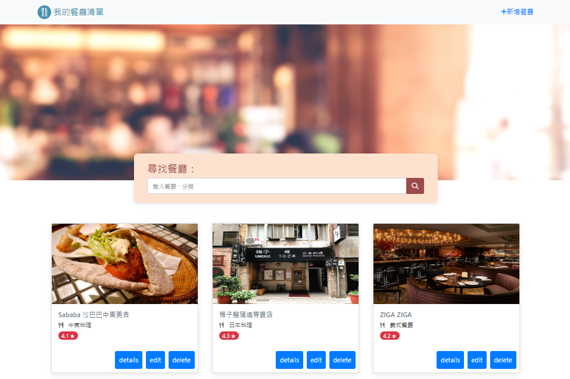

# Restaurant List (擴充CURD)

讓使用者可以瀏覽餐廳資料、並修改、新增。

## 功能介紹
* 瀏覽餐廳及其細節
* 創建餐廳資料
* 修改餐廳資料
* 可連結到GOOGLE MAP

## 首頁瀏覽



## 環境建置與需求 
* npm 
* node.js 

## 安裝
1. 將專案 clone 到本地
2. 透過終端機進入資料夾，輸入:
   ```
   git init -y
   ```
3. 安裝完畢後輸入:
   ```
   npm run dev
   ```
4. 看見此行訊息則代表順利運行:
   "express now is listening on prot 3000."
5. 請在瀏覽器輸入以下網址:
   http://localhost:3000
6. 結束使用請在終端機中輸入:
   ```
   ctrl + c
   ```
7. 再次開啟，從步驟3開始。

## 開發工具

* Node.js 16.17.1
* Express 4.17.1
* Express-Handlebars 4.0.2
* Mongoose 5.9.7
* Bootstrap 4.1.3
* Font-awesome 6.2.0
